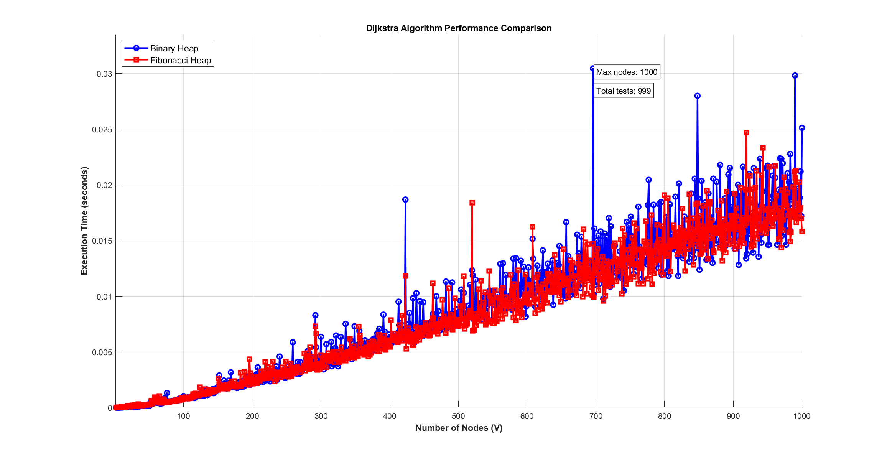
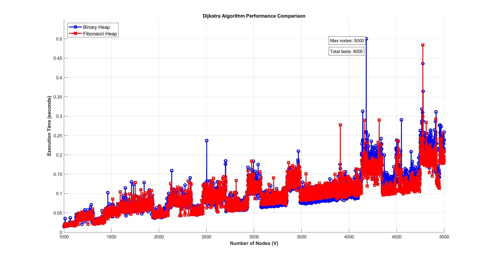
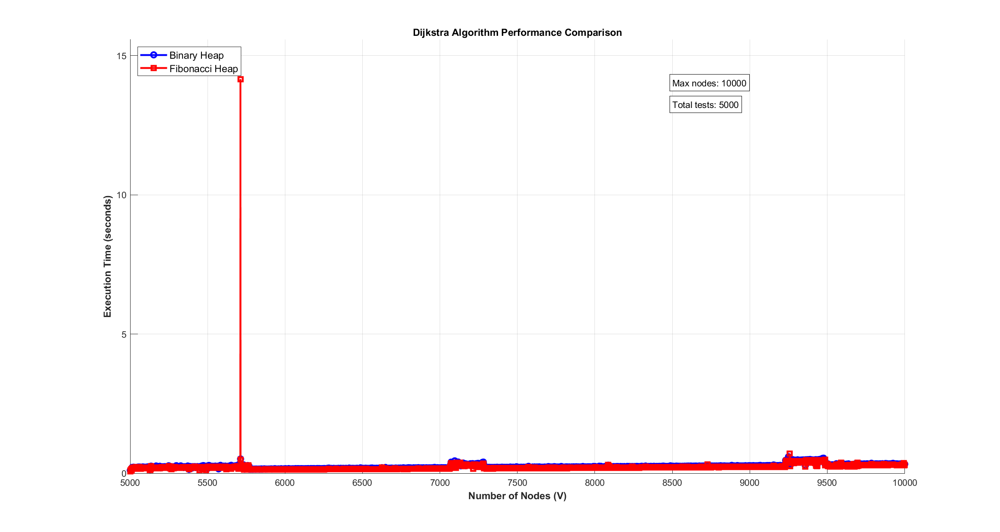

# 📊 FibonacciHeap vs BinaryHeap in Dijkstra – Final Project (HCMUTE 2025)

Final coursework for **Data Structures & Algorithms (ALDS335764)**  

---

## 📌 Project Summary

This project compares **Fibonacci Heap** and **Binary Heap** in Dijkstra's algorithm using **amortized analysis** (potential method).

### 🔧 Features
- Full Fibonacci Heap: `insert`, `extract_min`, `decrease_key`
- Dijkstra's algorithm with both heaps
- Benchmark with custom node range (2 → 10,000+)
- Auto-plot result via MATLAB (`.m` script)
- PNG chart export for quick comparison

---

## 📁 File Overview

| File                     | Description                                  |
|--------------------------|----------------------------------------------|
| `main.py`               | Core implementation (heap, dijkstra, test)   |
| `dijkstra_benchmark.m`  | MATLAB script to draw performance plots      |
| `*.png`                 | Saved charts for 3 node ranges               |
| `dijkstra_benchmark.fig`| MATLAB vector figure                         |

---

## 📈 Benchmark Results (Execution Time)

### ▶️ Nodes: 2–1000  


### ▶️ Nodes: 1001–5000  


### ▶️ Nodes: 5001–10000  


---

## 🚀 How to Run

```bash
python main.py
# Input range when asked (e.g., 1000:5000)
